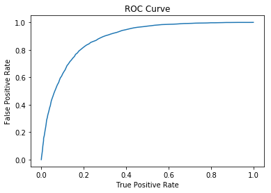

# Laboratorio 2-Sistemas Distribuidos

## Modelo de clasificación para predicir si los clientes de un banco realizarían un depósito a plazo.

## Integrantes:
 - Javier Pinto Guzmán.
 - Sebastian Pinto Guzmán.
 - Felipe Maturana Guerra.

## Descripción del problema

En el contexto del area bancarea, un banco desea iniciar una campaña de marketing para ofrcer depósitos a plazo.
Con el fin de que esta sea un exito, el banco planea contactarse con sus clientes a través de llamadas telefonicas, para ofrecer el producto, de tal forma que la interacción con estos sea mejor. Sin embargp, debido a la gran cantidad de clientes con los que cuenta el banco sería muy costoso, tanto en terminos economicos como de tiempo, contactarse con todos. Por lo tanto, el banco se vé obligado a llamar solo a una porción de sus clientes. No obstante, no existe garantia de que todos estos acepten. Así, se plantea la siguiente pregunta: ¿De qué forma se podría seleconar a los clientes para que la campaña sea un exito?.

## Enfoque de solución

### Solución propuesta

Para solucionar el problema planteado se recuree al area del Machine Learning y se propone la construcción de un modelo de regresión logística, el cualpermite clasificar, de forma binaria, a los clientes respecto a si realizarían el depósito o no.

El dataset utilizado para el entrenamiento del modelo corresponde al de aquellos clientes que formaron parte del proceso en campañas anteriores, el cual se obtiene directamente desde la base de datos del banco.

Para poder realizar consultas, el módulo clasificador se despliega como una Api que ofrece como servicios la construcción de un modelo, con un dataset específico, así como la consulta a este para predecir si uno o más clientes se subscribirían al depósito. 

A continuación se muestra un diagrama arquitectural que permite visualizar como se  lleva a producción el clasifiador

### Dataset

El dataset usado para este caso se obtiene de https://www.kaggle.com/rouseguy/bankbalanced, el cual corresponde
a una adaptación del dataset presente en UCI Machine Learning Repository (https://archive.ics.uci.edu/ml/datasets/Bank+Marketing). Dicho dataset corresponde a una lista de 11000 clientes aproximadamente, el cual también se encuentra balanceado. Además, es importante destacar que este modelo se construye siguiendo la guía de su autora, en el siguiente articulo https://towardsdatascience.com/machine-learning-with-pyspark-and-mllib-solving-a-binary-classification-problem-96396065d2aa.

Este dataset presenta la siguiente estructura:

 - age (Int): Edad del cliente.
 - job (String): Oficio del cliente, puede tomar los siguientes valores: 
    'admin.','blue-collar','entrepreneur','housemaid',
    'management','retired','self-employed','services',
    'student','technician','unemployed','unknown'
    
 - marital (String): Estado civil, puede tomar los siguientes valores:
     'divorced','married','single','unknown'
 - education (String): Nivel educacional, puede tomar los siguientes valores:
      'primary','secondary','tertiary'
 - default (String): Indica si el cliente tiene créditos actualmente:
      'yes','no'
 - balance (Int): Cantidad promedio de dinero que posee el cliente, de forma anual:
 - housing (String): Indica si el cliente posee crédito para la compra de una vivienda (Housing loan):
      'yes','no'
 - loan (String): Indica si la persona posee algún préstamo:
      'yes','no'
 - contact (String): Tipo de comunicación que se tiene con el cliente:
      'unknown','cellular','telephone'
 - duration (Int): Indica cuanto tiempo duró el último contacto que se tuvo con el cliente.
 - campaign (Int): Numero de contactos realizados con este cliente durante la campaña publicitaria.
 - pdays (Int): Numero de días que pasaron desde el último contacto realizado, para una campaña previa.
 - previous (Int): Numero de contactos realizados con este cliente antes de esta campaña.
 - poutcome (String): Resultados de la campaña de marketing anterior para este cliente:
      'success','failure','unknown'
 - deposit (String): Indica si el cliente aceptó hacer el depósito. (SOLO PARA ENTRENAMIENTO):
      'yes','no'
 - id (Int): Este campo sirve para diferenciar a los clientes y se agrega solo en caso de consultas.

## Desarrollo de la actividad

### Dificultades encontradas
Al desarrollar la actividad se encontraron las siguientes dificultades:

  - Existieron dificultades a la hora de comprender como darle persistencia al modelo creado.
  - Existieron algunas dificultades a la hora de comprender como interactuar con las herramientas de AWS.
  - La principal dificultad encontrada, la cual no se pudo superar, fue como usar Apache Spark en cluster mode, pues actualmente solo se ejecute en su forma local.
  
### Servicio que provee la API

Actualmente lo API solo provee un servicio, el cual permite predecir si algún cliente realizaría un depósito a plazo.
Este servicio recibe uno o más Json que deben seguir la estructura mencionada anteriormente y retorna, para cada cliente, un 1.0 en caso de que este se subscribiría al depósito y un 0.0 en el caso contrario.

### Resultados

### Evaluación modelo 

Para evaluar el modelo se hace uso de una curva ROC, la cual corresponde a una herramienta que se suele usar para evaluar la efectividad de un clasificador:

El area bajo la curva indica la capacidad que tiene el modelo para distinguir entre las dos clases a la hora de realizar la predicción. Mientras mas cercano a 1 sea el valor, significa una mayor precision. Para este caso el area es de 0.8849092421146739. 

### Almacenamiento del modelo

Para la implementación de este Api es necesario contar con dos elementos importantes, los cuales corresponden a un Pipeline y el modelo clasificador. El primero corresponde a un conjunto de procedimientos a través del cual se pre-procesan los datos, para que estos sean envados al modelo con el fin de efectuar la clasificación. Tal como se puede apreciar en la imagen, ambos elementos fueron construidos previamente y se encuentran almacenados en Amazon s3.

[S3]

### Despliegue de la API

La APi se encuentra desplegada en Amazon EC2 en un contenedor. Esta puede ser accedida desde la siguiente iP [Ip api]. En la siguiente imagen se puede confirmar dicho despliegue:

[EC2]

## Link de Acceso

Como se menciona anteriormente, para acceder al servicio de consulta se usar la siguiente dirección ip: [IP api] . Además se debe enviar un arreglo con 1 o más Json que sigan la estructura mencionada anteriormente.

## Despliegue del servicio

El servicio se encuentra alojado en un contenedor, por lo que es necesario tener instalado Docker. Cosiderando esto, los pasos para desplegar el serivicio son los siguientes.

- Instalar Docker

- Clonar el repositorio

- Ejecutar el siguiente comando para consturir la imagen docker: sudo docker build -t <nombre-imagen>:<tag> .
 
- Crear una instancia de la imagen creada: sudo docker run --name <nombre contenedor> -p 8080:8080 <nombre-imagen>:<tag>
 
- Luego de seguir estos pasos, se podra consultar la Api en el puerto 8080.

